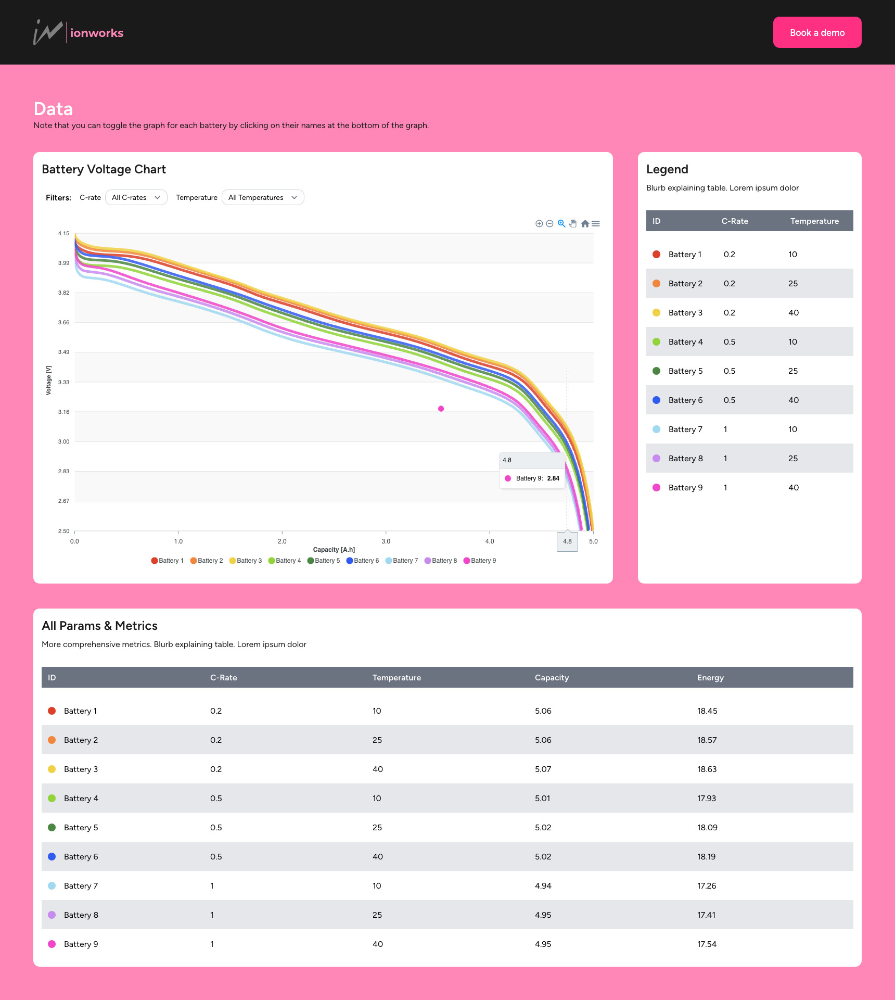

Scroll to bottom of Readme for a screenshot :)

# Run Locally

1. Clone the project to your local machine

2. `cd` in to repo and run:

        composer install
        npm install

3. To run the project, in one terminal run the following to build the site:

        composer run dev

And in another terminal run the following to serve the site

    
        php artisan serve
    
   

# Files where you can find the work:

  * /resources/js/pages/Welcome.vue 
    - This is the main page of the app
  * /resources/js/shared/services
    - This is a service I built to make axios calls easier (calling data from backend still in progress)
  * /app/Http/Controllers/DataController.php
    - This is the controller that manages API calls
    - I didn't create a database so the data is an object in this datacontroller file, and is returned as a json response via API call based on data variables passed in the URI 
  * /routes/api.php
    - Where the route to call the controller is defined

